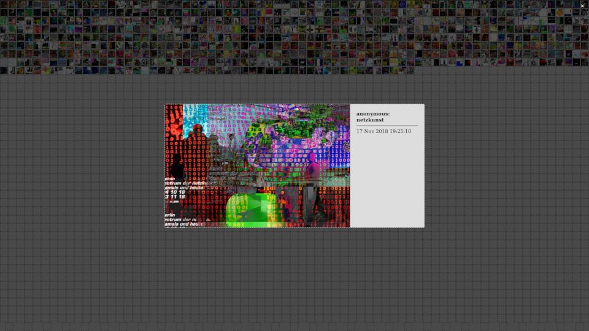

# Gallery

This extension of the [net.art generator](https://nag.iap.de) displays a collection of the generated images as thumbnails in a grid, allowing to click on them to open a more detailed view of the image.



as seen in:

* [Berlin Zentrum der Netzkunst, damals und heute](https://netzkunst.berlin/) exhibition at the [panke.gallery](http://www.panke.gallery/) in Berlin, 4 October - 23 November 2018
* [Writing the History of the Future](https://zkm.de/de/ausstellung/2019/02/writing-the-history-of-the-future) exhibition at the [ZKM](https://zkm.de/) in Karlsruhe, 23 February 2019 - 28 March 2021

## Setup

🚧 WIP 🚧

* Requirements
  * File/folder structure (& permissions/user)
    * source directory
    * working directory
    * backup directory
  * Dependencies
    * PHP Frontend
      * Caching headers (moved to Web server configuration)
      * Currently optimized for fullscreen use with a resolution of 1920x1080 pixels, thumbnail size of 24 ($size/parameter: size), 2769 thumbnails in the grid ($imgLimit/parameter: limit)
    ```
    // fullpath is the pattern for selecting the images from the source directory
    $fullpath = "/var/www/gallery/thumbs/*@*.*";
    // newbase defines the base path to use for the image links
    $newbase = "thumbs/";
    ```
      * Packages (Debian)
    * Shell Backend
    ```
    is_command_available_critical date
    is_command_available_critical find
    is_command_available_critical inotifywait
    is_command_available_critical rm
    is_command_available_critical rsync
    ```
      * Packages (Debian)

🚧 WIP 🚧

Following is a more detailed explanation of the different files:

### [explanation.html](explanation.html)

explanation.html is the unauthorized (401) error page which is shown in case a user provided wrong credentials or aborted the login process.

### [ifs.sh](ifs.sh)

ifs.sh is the inotify-based file sync with date-based filtering script.  
Its job is to transfer images from one folder to another, sounds simple, should be simple – Maybe a little too simple, that's why inotify is used to trigger a rsync job in a timely manner.

Try `ifs.sh -h` for the help output.

Lesson learned: `inotifywait` is a great tool to use on the command line for blocking inotify event handling.

### [gallery.php](gallery.php)

gallery.php is the web frontend to the thumbnail collection and hopefully evolves into something useful in the next couple of days.

#### Parameters

Integrated during development to play around with sizes and different views:

* `limit=2769`: use a limit of 2.769 images for the grid (accepts values between 400 and 4.000)
* `size=24`: use a thumbnail size of 24px (accepts values between 5 and 400)
* `refresh=n`: turn off the automatic refresh
